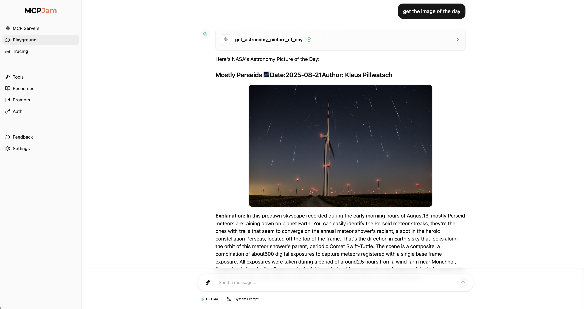
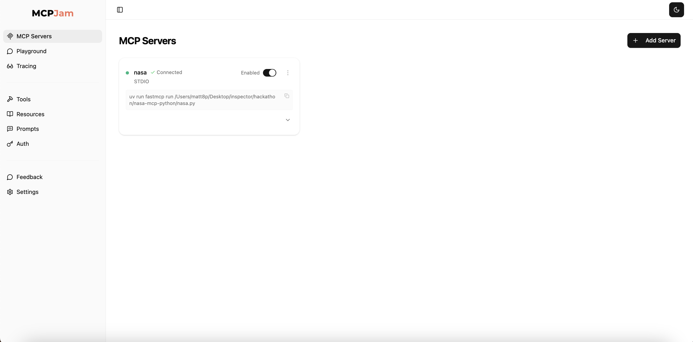

# NASA MCP Server Hackathon



In this hackathon project, we will build a basic MCP server that connects to the NASA.gov API to fetch their image of the day. The estimated time of the project is 10 minutes.

## Prerequisites

- Python
- `npx` installed (to run MCPJam inspector)
- `uv` installed
- OpenAI API Token (https://platform.openai.com/api-keys)

## Step 1: Set up your environment

We need to create a new MCP server project. Set the `uv` environment and create an empty Python file

macOS/Linux:

```
# Create a new directory for our project
uv init nasa
cd nasa

# Create virtual environment and activate it
uv venv
source .venv/bin/activate

# Install dependencies
uv add "mcp[cli]" httpx

# Create our server file
touch nasa.py
```

Windows:

```
# Create a new directory for our project
uv init nasa
cd nasa

# Create virtual environment and activate it
uv venv
.venv\Scripts\activate

# Install dependencies
uv add mcp[cli] httpx

# Create our server file
new-item nasa.py
```

## Step 2: Get an API token from NASA.gov

Getting an API token from NASA.gov is free. [Click here](https://api.nasa.gov/) to get a API token. The token gets emailed to you.

We'll refer the API token as `<NASA_API_TOKEN>` throughout the tutorial

## Step 3: Implement the NASA MCP Server

Open `nasa.py` and let's build the server step by step:

### Step 3a: Import Dependencies

Imports the necessary libraries - `httpx` for HTTP requests and `FastMCP` for simplified MCP server creation

```python
from typing import Any
import httpx
from mcp.server.fastmcp import FastMCP
```

### Step 3b: Initialize the Server

Sets up the FastMCP server instance and defines constants for the NASA API

```python
# Initialize FastMCP server
mcp = FastMCP("nasa")

# Constants
NASA_API_BASE = "https://api.nasa.gov"
NASA_API_KEY = "<NASA_API_TOKEN>"  # Replace with your actual API token
```

**Important:** Replace `<NASA_API_TOKEN>` with your actual NASA API token from Step 2.

### Step 3c: Create Helper Function

Creates a helper function that handles HTTP requests to NASA's API with error handling

```python
async def make_nasa_request(url: str) -> dict[str, Any] | None:
    """Make a request to the NASA API with proper error handling."""
    params = {"api_key": NASA_API_KEY}
    async with httpx.AsyncClient() as client:
        try:
            response = await client.get(url, params=params, timeout=30.0)
            response.raise_for_status()
            return response.json()
        except Exception:
            return None
```

### Step 3d: Define the Main Tool

Define the main tool that fetches the astronomy picture and formats it nicely with emojis and markdown

```python
@mcp.tool()
async def get_astronomy_picture_of_day(date: str = None) -> str:
    """Get NASA's Astronomy Picture of the Day (APOD).

    Args:
        date: Optional date in YYYY-MM-DD format. If not provided, returns today's image.
    """
    url = f"{NASA_API_BASE}/planetary/apod"

    if date:
        url += f"?date={date}"

    data = await make_nasa_request(url)

    if not data:
        return "Unable to fetch APOD data from NASA API."

    # Get the image URL (prefer HD if available)
    image_url = data.get('hdurl') or data.get('url')

    # Format the response with markdown image
    result = f"""
🌌 NASA Astronomy Picture of the Day

📅 Date: {data.get('date', 'Unknown')}
📝 Title: {data.get('title', 'Unknown')}
👨‍🚀 Author: {data.get('copyright', 'NASA')}
📖 Explanation: {data.get('explanation', 'No explanation available')}

{image_url and f"" or "No image available"}
"""

    return result
```

The `@mcp.tool()` decorator automatically handles the MCP protocol details.

### Step 3e: Add the Main Entry Point

```python
if __name__ == "__main__":
    mcp.run(transport='stdio')
```

## Step 4: Test the MCP NASA Server

### 1. **Start the MCPJam inspector:**

This command will open up the MCPJam inspector with the server configured

```bash
npx @mcpjam/inspector@latest uv run fastmcp run <FILE_PATH>
```

Replace the `<FILE_PATH>` with the path to your `nasa.py` file. For example, `/Users/matt8p/Desktop/nasa/nasa.py`. Once you run the command, you should see that the inspector connected to your MCP NASA server



### 2. Set up your OpenAI API token

Go to the MCPJam inspector's setting tab. You should see "AI Providers" settings. Paste in your OpenAI API token.

### 3. Test your server in Playground

Go to the MCPJam inspector's Playground tab. You should now be able to interact with your NASA MCP server. Try a query like "Show me the picture of the day".

## Step 5: Build more features (explore!)

There are a ton of awesome endpoints on the NASA API. You could try to:

- Get the weather on Mars
- Explore Exoplanets
- Get images of Mars rover

The API endpoints NASA provides can be [found here](https://api.nasa.gov/).

## MCPJam Community

We're creating MCP hackathon projects every week. If you'd like any live support, join our [Discord community](https://discord.com/invite/JEnDtz8X6z)

Please consider supporting this project and giving it a star on GitHub!
https://github.com/MCPJam/inspector

## Quick Troubleshooting

- **Server failure:** Make sure your virtual environment is activated and dependencies are installed
- **API errors:** Verify your NASA API token is correct and not expired
- **Image not showing:** Check if the NASA API returned a valid image URL
